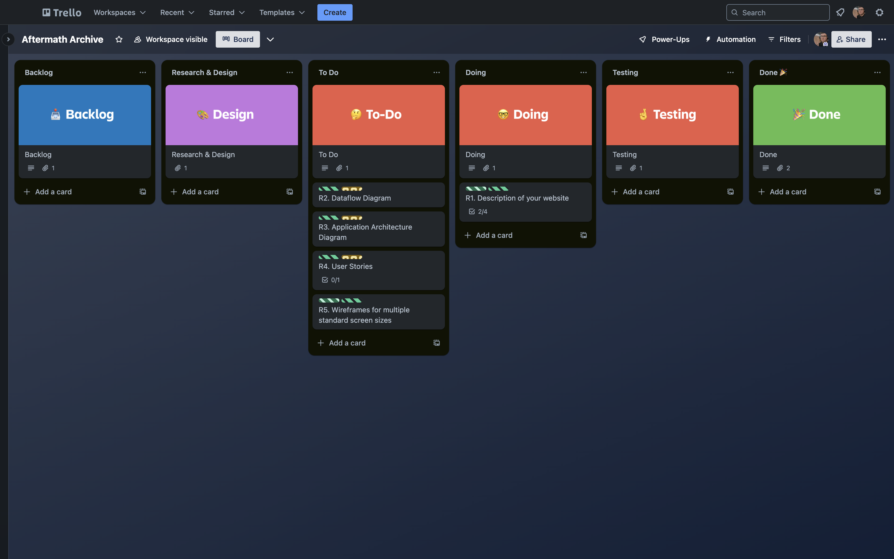

# proposal-and-planning-docs

    

This repository captures documentation for the initial proposal and planning stages of this project for the T3A3-A requirements.

# R1 Description of your website, including purpose, functionality, target audience, and tech stack.

## Purpose

Aftermath Archive is a web application designed to help development and IT teams document, analyze, and learn from incidents that impact system reliability. Its purpose is to provide a centralized, accessible repository for capturing the details of incidents and post-mortems, enabling teams to understand root causes, track follow-up actions, and improve system resilience by preventing similar issues in the future.

## Functionality / features

-   **Incident Logging:** Users can log new incidents, documenting key details like type, timestamp, severity, and initial actions taken.
-   **Post-Mortem Documentation:** After incidents are resolved, users can create structured post-mortem reports, including fields for root cause analysis, timeline, impact assessment, and action items.
-   **Status Tracking:** Each incident progresses through defined statuses (e.g., “Open,” “In Progress,” “Closed - Awaiting Post-Mortem,” “Closed - Complete”), allowing teams to track incidents from initial log to resolution.
-   **Search and Filter:** Users can search through incidents using Fuse.js for fuzzy searching, making it easy to find specific incidents based on keywords, severity, status, or type.
-   **In-App Alerts:** Using React-Toastify, users are notified of updates to incidents they are tracking or new action items.

## Target audience

Aftermath Archive is aimed at organizations of all sizes that need an accessible, focused tool for incident management and post-mortem documentation. This app particularly appeals to companies looking for a streamlined, cost-effective alternative to complex enterprise solutions. The target audience includes:

### 1. Small to Medium-Sized Companies:

Many smaller companies don’t have the budget or resources to develop their own incident management tools or subscribe to high-cost enterprise software like Atlassian or ServiceNow. Aftermath Archive offers an open-source, fully-featured alternative, providing them with specialized incident tracking and post-mortem capabilities without the overhead or unnecessary complexity.

### 2. Larger Companies Relying on Internal, Non-Specialized Tools:

In many larger organizations, teams may rely on general-purpose tools like Google Docs, Excel, or basic ticketing systems to document incidents and post-mortems. These tools are often unsuited to tracking incident resolution and learning from historical data. By providing a free, purpose-built tool for incident management, Aftermath Archive offers these companies a more efficient, reliable way to log and learn from incidents without requiring a costly or complex software overhaul.

### 3. Companies Creating Their Own Bespoke Software:

While larger enterprises often create custom tools for incident management, Aftermath Archive provides a reference point and potential starting foundation as an open-source solution. Organizations interested in developing or enhancing their own incident management systems can leverage Aftermath Archive’s codebase, potentially customizing it to fit specific internal workflows and requirements.

By positioning Aftermath Archive as an open-source tool, we aim to attract companies currently in the second and third categories, offering them a robust, purpose-built option that provides the focus and functionality of expensive enterprise tools—without the cost or unnecessary bloat.

For specific roles within the company, we target more specifically:

### Site Reliability Engineers (SREs):

SREs who manage system uptime and reliability would benefit from Aftermath Archive’s incident tracking and documentation capabilities.

### IT Operations and Support Teams:

These teams often handle urgent incidents and would use Aftermath Archive to document and analyze incidents to reduce recurrence.

### Developers in DevOps Environments:

Developers involved in incident management would use the app to improve response times and learn from past issues.

## Tech stack

Aftermath Archive is built on a MERN stack (MongoDB, Express, React, Node.js) to provide a responsive, full-stack web experience:

### Core Libraries

-   **Frontend:** React with shadcn/ui for styling and responsive design.
-   **Backend:** Node.js and Express to handle the API and business logic.
-   **Database:** MongoDB, using Mongoose for schema management and data modeling.

### Proposed Additional Libraries:

-   **Quill.js:** for rich text editing in post-mortem documentation.
-   **Fuse.js:** for fast, fuzzy search functionality.
-   **React-Toastify:** for in-app alerts and notifications.

# R2 Dataflow Diagram

The following diagrams use the System Structured Analysis and Design Methodology (SSADM) notation system for dataflow diagrams (DFD).

## Level 0 Diagram

## Level 1 Diagram

## Level 2 Subprocess diagrams

### Log Incident

### Search and Filter Incidents

### Update Incident Status

### Create Post Mortem (Stretch Feature)

### Notifications and Alerts (Stretch Feature)

### Authentication (Internal)

#### Register

#### Login

### Authentication (Oauth - External Provider) (Stretch Feature)

#### Register

#### Login

# R3 Application Architecture Diagram

# R4 User Stories

A user story is an informal, general explanation of a software feature written from the perspective of the end user. Its purpose is to articulate how a software feature will provide value to the customer. [(Atlassian, 2024)](https://www.atlassian.com/agile/project-management/user-stories)

All user stories follow the standardised format of:
“As a [persona], I [want to], [so that].”

Due to the length of the user stories and personas, they are also available as separate md files for convenience.

-   You can find the first iteration of user stories [here](./docs/user-stories-and-personas/user-stories-v1.md)
-   You can find the Personas [here](./docs/user-stories-and-personas/personas.md)
-   You can find the finalised user stories with personas [here](./docs/user-stories-and-personas/user-stories-with-personas.md)

## First Iteration of User Stories

1. Incident Logging
   As a user, I want to log a new incident by providing key details such as incident type, timestamp, and description. So that I can ensure the incident is documented for tracking and future analysis.

2. Post-Mortem Documentation
   As a user, I want to create a post-mortem report for a resolved incident, including root cause, impact, and action items. So that I can document lessons learned and prevent similar issues in the future.

3. Incident Status Updates
   As a user, I want to update the status of an incident (e.g., “Open,” “In Progress,” “Closed”) as it progresses. So that I can keep my team informed and track the resolution process.

4. Search and Filter Incidents
   As a user, I want to search and filter incidents by status, severity, or keywords. So that I can quickly find relevant incidents without manually sorting through the list.

5. Notifications and Alerts
   As a user, I want to subscribe to specific incidents and receive notifications about updates or changes. So that I am immediately informed of important updates without actively monitoring the system.

6. Authentication
   As a user, I want to log in securely using my credentials or an external provider (e.g., Google OAuth). So that I can access the application while ensuring my data is secure.

7. Role-Based Access Control (Stretch Goal)
   As an admin, I want to assign roles to team members, granting different levels of access. So that I can control who can view, edit, or delete incidents or post-mortems.

8. Notification Configuration (Stretch Goal)
   As a user, I want to configure which types of notifications I receive (e.g., email, in-app). So that I can reduce noise and only get updates relevant to my role.

9. Analytics Dashboard (Stretch Goal)
   As a user, I want to view a dashboard summarizing key metrics, such as the number of incidents logged or recurring issues. So that I can identify trends and take proactive measures to address frequent problems.

10. Export Post-Mortem (Stretch Goal)
    As a user, I want to export post-mortem reports as PDFs to share with external stakeholders. So that I can communicate findings and action items easily.

## Personas
Personas follow the [Atlassian Persona template.](https://www.atlassian.com/software/confluence/templates/persona)

### Persona 1: “Efficient Emily” – The IT Support Specialist

#### Nuts and Bolts:

-   Job Title: IT Support Specialist
-   Job Description: Handles technical issues, monitors system uptime, and ensures smooth operation of IT infrastructure. Often the first point of contact during outages or system issues, tasked with incident logging and troubleshooting.
-   Industry/Company: Works at a medium- sized SaaS company focused on delivering reliable services to their customers.

#### Demographics:

-   Age: Late 20s
-   Gender: Female
-   Estimated Income: $65,000 - $85,000 annually
-   Education Level: Bachelor’s degree in Information Technology or a related field
-   Location: Lives in an urban area with access to a vibrant tech community.

#### Aligning to Reality:

Quote:

“I need an incident management system that’s easy to use and helps me track issues without adding to my workload.”

Bio:

Emily has been in IT support for six years, working her way up from a junior role. She’s passionate about solving problems quickly and efficiently and relies on streamlined tools to help her stay on top of a growing list of tasks. When she’s not resolving technical issues, Emily works on documenting incidents and analyzing patterns to improve system stability.

#### What Makes Emily Tick:

Professional Goals:

-   Log incidents efficiently to track recurring issues.
-   Minimize downtime by having clear documentation and processes.
-   Keep teams informed during outages.

Challenges:

-   Managing incidents in a fast- paced environment with limited resources.
-   Sorting through unorganized incident data to find historical trends.
-   Staying informed about ongoing incidents without constant manual updates.

Motivators:

-   Tools that simplify workflows and save time.
-   Positive feedback from her team and management.
-   Seeing measurable improvements in system reliability.

Sources of Information:

-   IT community forums like Spiceworks and Reddit’s r/sysadmin.
-   Technical blogs and newsletters (e.g., TechCrunch, Ars Technica).
-   Recommendations from peers at conferences and meetups.

### Persona 2: “Strategic Sam” – The Engineering Team Lead

#### Nuts and Bolts:

-   Job Title: Engineering Team Lead
-   Job Description: Oversees the engineering team, manages complex projects, and ensures system reliability. Leads post- mortem discussions to identify root causes and implement preventative measures.
-   Industry/Company: Works at a growing fintech startup that relies on a robust backend to process transactions seamlessly.

#### Demographics:

-   Age: mid 30s
-   Gender: Male
-   Estimated Income: $90,000 - $120,000 annually
-   Education Level: Bachelor’s or Master’s degree in Computer Science or Engineering
-   Location: Based in a tech hub like San Francisco, Sydney, or London.

#### Aligning to Reality:

Quote:

“Post- mortems are crucial for improving our processes, but they often lack structure and actionable insights.”

Bio:

Sam started as a software developer and gradually climbed the ranks to a leadership position. He takes pride in his ability to mentor team members and solve complex problems. Sam believes that clear communication and robust incident management practices are essential for fostering a productive and resilient team culture.

#### What Makes Sam Tick:

Professional Goals:

-   Improve team performance through better documentation and analysis.
-   Streamline incident resolution processes to minimize downtime.
-   Use analytics to proactively identify and address system weaknesses.

Challenges:

-   Lack of structured post- mortems that lead to actionable outcomes.
-   Managing team workflows during high- pressure incidents.
-   Ensuring accountability and access control within the team.
    Motivators:
-   Seeing his team grow and succeed under his leadership.
-   Tools that provide actionable insights and improve efficiency.
-   Collaboration and knowledge- sharing with other teams.

Sources of Information:

-   Professional networking sites like LinkedIn.
-   Engineering blogs (e.g., Medium’s software engineering section, HackerNoon).
-   Industry conferences such as AWS re:Invent or Google Cloud Next.

### Persona 3: “Meticulous Morgan” – The Systems Administrator

#### Nuts and Bolts:

-   Job Title: Senior Systems Administrator
-   Job Description: Manages critical systems that require high uptime, leads incident response efforts, and ensures proper role- based access to tools and data. Focuses on compliance and security alongside system reliability.
-   Industry/Company: Works for a multinational enterprise with stringent regulatory requirements.

#### Demographics:

-   Age: mid 40s
-   Gender: Non- binary
-   Estimated Income: $110,000 - $140,000 annually
-   Education Level: Bachelor’s degree in Computer Science, plus certifications (e.g., AWS Solutions Architect, CISSP).
-   Location: Lives in a suburban area with a quick commute to a corporate office.

#### Aligning to Reality:

Quote:

“Access control and incident trends are non- negotiable. Without them, I can’t ensure compliance or system security.”

Bio:

Morgan has 20 years of experience in IT and is a trusted advisor within their organization. They are detail- oriented and focus on ensuring that their systems are both compliant with regulations and highly available.

#### What Makes Morgan Tick:

Professional Goals:

-   Maintain system uptime and reliability.
-   Ensure compliance with regulatory standards through proper documentation.
-   Use role- based controls to limit access to sensitive data.

Challenges:

-   Balancing security and ease of use in tools.
-   Limited analytics for identifying recurring issues.
-   Difficulty exporting reports for audits.

Motivators:

-   Seeing systems run smoothly with minimal disruptions.
-   Tools that integrate compliance and security features.
-   Recognition for maintaining high system availability.

Sources of Information:

-   Certification bodies (e.g., ISACA, AWS Training).
-   Security blogs and whitepapers (e.g., Krebs on Security).
-   Industry standards like NIST and ISO.

### Persona 4: “Curious Casey” – The Junior Developer

#### Nuts and Bolts:

-   Job Title: Junior Developer
-   Job Description: Works on development tasks and assists with debugging during incidents. Uses incident data and post- mortems to improve their skills and learn best practices.
-   Industry/Company: Works for a startup focused on developing innovative SaaS products.

#### Demographics:

-   Age: early 20s
-   Gender: Male
-   Estimated Income: $50,000 - $65,000 annually
-   Education Level: Bachelor’s degree in Software Development or a related field.
-   Location: Lives in a shared apartment in an urban area near the company office.

#### Aligning to Reality:

Quote:

“I want to learn from post- mortems and improve my skills without getting overwhelmed by too much data.”

Bio:

Casey is fresh out of university and eager to prove himself. He often relies on his team for guidance but is motivated to grow into a more independent role. Casey uses incident tools to stay informed and learn from past mistakes.

#### What Makes Casey Tick:

Professional Goals:

-   Learn from incidents to improve debugging and coding skills.
-   Stay updated on active incidents to provide support when needed.
-   Access clear and concise post- mortems for educational purposes.

Challenges:

-   Difficulty prioritizing which incidents to follow.
-   Limited understanding of how to navigate complex incident systems.
-   Feeling overwhelmed by unnecessary notifications.

Motivators:

-   Gaining experience and recognition within the team.
-   Tools that provide easy- to- understand insights and tutorials.
-   Learning opportunities from real- world examples.

Sources of Information:

-   Online coding forums (e.g., Stack Overflow).
-   Development blogs and YouTube tutorials.
-   Team mentors and senior developers.

## Updated User Stories with Personas

## Core Features

### Incident Logging

As Efficient Emily, I want to log a new incident by providing key details such as incident type, timestamp, and description. So that I can ensure the incident is documented for tracking and future analysis.

### Incident Status Updates

As Meticulous Morgan, I want to update the status of an incident (e.g., “Open,” “In Progress,” “Closed”) as it progresses. So that I can keep records accurate and ensure compliance with processes.

### Search and Filter Incidents

As Curious Casey, I want to search and filter incidents by status, severity, or keywords. So that I can quickly find relevant incidents to learn from without manually sorting through the list.

### Notifications and Alerts

As Strategic Sam, I want to subscribe to specific incidents and receive notifications about updates or changes. So that I am immediately informed of important updates without actively monitoring the system.

### Authentication

As Meticulous Morgan, I want to log in securely using my credentials or an external provider (e.g., Google OAuth). So that I can access the application while ensuring my data and systems are secure.

### Analytics Dashboard

As Strategic Sam, I want to view a dashboard summarizing key metrics, such as the number of incidents logged or recurring issues. So that I can identify trends and take proactive measures to address frequent problems.

### Incident Tagging

As Efficient Emily, I want to tag incidents with relevant keywords during logging, so that I can categorize and search for incidents more efficiently in the future.

### Incident Prioritization

As Efficient Emily, I want to prioritize incidents by severity or urgency, so that I can focus on resolving the most critical issues first.

### Status Progress Notifications

As Efficient Emily, I want to receive notifications when an incident I’ve logged moves to a new status, so that I can stay informed about its progress.

## Stretch Features

### Post-Mortem Documentation

As Strategic Sam, I want to create a post-mortem report for a resolved incident, including root cause, impact, and action items. So that I can document lessons learned and prevent similar issues in the future.

### Export Post-Mortem

As Curious Casey, I want to export post-mortem reports as PDFs to share with external stakeholders. So that I can communicate findings and action items easily.

### Role-Based Access Control

As Meticulous Morgan, I want to assign roles to team members, granting different levels of access. So that I can control who can view, edit, or delete incidents or post-mortems.

### Notification Configuration

As Efficient Emily, I want to configure which types of notifications I receive (e.g., email, in-app). So that I can reduce noise and only get updates relevant to my role.

### User Dashboard

As Efficient Emily, I want a personalized dashboard showing incidents I’m involved with and their statuses, so that I can quickly access the information I need.

### Team Collaboration

As Strategic Sam, I want to leave comments on incidents and tag other team members, so that we can collaborate more effectively during resolution.

### Saved Filters

As Curious Casey, I want to save my most frequently used search filters, so that I can quickly access the information I need without setting up the criteria every time.

### Incident Ownership

As Meticulous Morgan, I want to assign ownership of an incident to specific team members, so that accountability is clear, and resolution responsibility is defined.

## Future Features (Unlikely to be completed due to time constraints)

### Integration with Monitoring Tools

As Meticulous Morgan, I want to integrate the app with monitoring tools like Datadog or Splunk, so that incidents can be automatically logged based on detected anomalies.

### Knowledge Base

As Curious Casey, I want to link incidents and post-mortems to a central knowledge base, so that I can learn from previous issues and find solutions faster.

### Recurring Incident Identification

As Strategic Sam, I want the app to flag incidents that match previous issues based on tags or descriptions, so that I can identify and address recurring problems.

### Audit Logs

As Meticulous Morgan, I want an audit log of all actions taken on incidents, including status updates and field changes, so that I can ensure accountability and maintain compliance.

### Incident Attachments

As Curious Casey, I want to upload logs, screenshots, or related files to an incident, so that I can provide additional context and evidence for analysis.

# R5 Wireframes for multiple standard screen sizes, created using industry standard software

Figma used for all wireframes.
Current proposition is to use the Teal palette as specified by ShadCN.

Teal strikes a balance between calm professionalism (blue tones) and modern freshness (green tones). It’s suitable for a tool intended to help users manage stress-inducing incidents without overwhelming them. Teal is easy on the eyes for prolonged usage, and it aligns with accessibility goals, as it’s less likely to cause strain compared to highly saturated or bright palettes.

Not depicted in the wireframes, but I plan to add complementary accent colors for specific features (e.g., status indicators, error messages):

-   Warning: Amber or gold (a muted yellow-orange for contrast).
-   Error: Muted red or coral (avoiding overly bright tones to maintain the teal’s calm aesthetic).

Broadly speaking, due to the target demographic of this application it is designed as being desktop first (as is the case of similar workplace apps of this nature). However, during development steps will be made to ensure mobile users are fully supported.

## Figma Overview

## Universal

### Marking Page

## Desktop

### Dashboard

### Login / Sign Up

### Search Incidents

### View / Update Incident

### Create Incident

## Mobile

### Login / Sign Up

### Dashboard

### Search Incidents

### View / Update Incident

### Create Incident

## Collapsible Menu

# R6 Screenshots of your Kanban board throughout the duration of the project

## Initial Setup

Utilising the Kanban board template.

Labels used to indicate task category, and difficulty.

Tasks were created for each requirement. Tasks were broken down further where applicable with checklists. All timebound tasks have due dates attached, and GitHub integration has been set up for the next stage in the project.

## Use During Project

