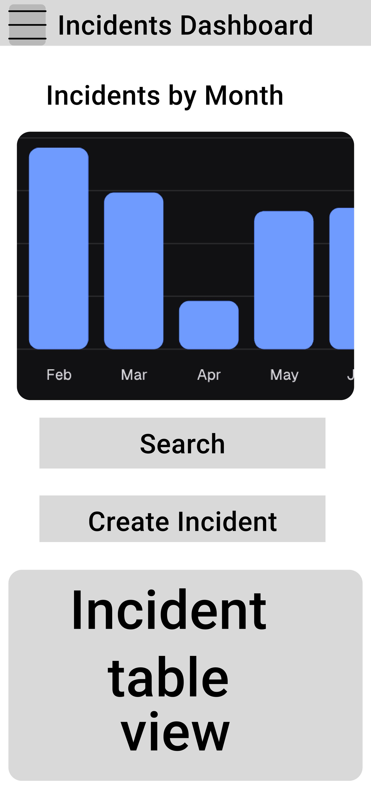

# proposal-and-planning-docs

This repository captures documentation for the initial proposal and planning stages of this project for the T3A3-A requirements.

# R1 Description of your website, including purpose, functionality, target audience, and tech stack.

## Purpose

Aftermath Archive is a web application designed to help development and IT teams document, analyze, and learn from incidents that impact system reliability. Its purpose is to provide a centralized, accessible repository for capturing the details of incidents and post-mortems, enabling teams to understand root causes, track follow-up actions, and improve system resilience by preventing similar issues in the future.

## Functionality / features

- **Incident Logging:** Users can log new incidents, documenting key details like type, timestamp, severity, and initial actions taken.
- **Post-Mortem Documentation:** After incidents are resolved, users can create structured post-mortem reports, including fields for root cause analysis, timeline, impact assessment, and action items.
- **Status Tracking:** Each incident progresses through defined statuses (e.g., “Open,” “In Progress,” “Closed - Awaiting Post-Mortem,” “Closed - Complete”), allowing teams to track incidents from initial log to resolution.
- **Search and Filter:** Users can search through incidents using Fuse.js for fuzzy searching, making it easy to find specific incidents based on keywords, severity, status, or type.
- **In-App Alerts:** Using React-Toastify, users are notified of updates to incidents they are tracking or new action items.

## Target audience

Aftermath Archive is aimed at organizations of all sizes that need an accessible, focused tool for incident management and post-mortem documentation. This app particularly appeals to companies looking for a streamlined, cost-effective alternative to complex enterprise solutions. The target audience includes:

### 1.	Small to Medium-Sized Companies: 
Many smaller companies don’t have the budget or resources to develop their own incident management tools or subscribe to high-cost enterprise software like Atlassian or ServiceNow. Aftermath Archive offers an open-source, fully-featured alternative, providing them with specialized incident tracking and post-mortem capabilities without the overhead or unnecessary complexity.

### 2.	Larger Companies Relying on Internal, Non-Specialized Tools: 
In many larger organizations, teams may rely on general-purpose tools like Google Docs, Excel, or basic ticketing systems to document incidents and post-mortems. These tools are often unsuited to tracking incident resolution and learning from historical data. By providing a free, purpose-built tool for incident management, Aftermath Archive offers these companies a more efficient, reliable way to log and learn from incidents without requiring a costly or complex software overhaul.

### 3.	Companies Creating Their Own Bespoke Software: 
While larger enterprises often create custom tools for incident management, Aftermath Archive provides a reference point and potential starting foundation as an open-source solution. Organizations interested in developing or enhancing their own incident management systems can leverage Aftermath Archive’s codebase, potentially customizing it to fit specific internal workflows and requirements.

By positioning Aftermath Archive as an open-source tool, we aim to attract companies currently in the second and third categories, offering them a robust, purpose-built option that provides the focus and functionality of expensive enterprise tools—without the cost or unnecessary bloat.

For specific roles within the company, we target more specifically:
### Site Reliability Engineers (SREs): 
SREs who manage system uptime and reliability would benefit from Aftermath Archive’s incident tracking and documentation capabilities.
### IT Operations and Support Teams: 
These teams often handle urgent incidents and would use Aftermath Archive to document and analyze incidents to reduce recurrence.
### Developers in DevOps Environments: 
Developers involved in incident management would use the app to improve response times and learn from past issues.

## Tech stack

Aftermath Archive is built on a MERN stack (MongoDB, Express, React, Node.js) to provide a responsive, full-stack web experience:

### Core Libraries

-   **Frontend:** React with Material-UI for styling and responsive design.
-   **Backend:** Node.js and Express to handle the API and business logic.
-   **Database:**   MongoDB, using Mongoose for schema management and data modeling.

### Additional Libraries:

-   **Quill.js:** for rich text editing in post-mortem documentation.
-   **Fuse.js:** for fast, fuzzy search functionality.
-   **React-Toastify:** for in-app alerts and notifications.

# R2 Dataflow Diagram
The following diagrams use the System Structured Analysis and Design Methodology (SSADM) notation system for dataflow diagrams (DFD). 

## Level 0 Diagram 

## Level 1 Diagram

## Level 2 Subprocess diagrams 
### Log Incident 

### Search and Filter Incidents

### Update Incident Status 

### Create Post Mortem (Stretch Feature)

### Notifications and Alerts (Stretch Feature)

### Authentication (Internal)
#### Register

#### Login

### Authentication (Oauth - External Provider) (Stretch Feature)
#### Register

#### Login

# R3 Application Architecture Diagram

# R4 User Stories

# R5 Wireframes for multiple standard screen sizes, created using industry standard software
Figma used for all wireframes. 
Current proposition is to use the Teal palette as specified by ShadCN. 

Teal strikes a balance between calm professionalism (blue tones) and modern freshness (green tones). It’s suitable for a tool intended to help users manage stress-inducing incidents without overwhelming them. Teal is easy on the eyes for prolonged usage, and it aligns with accessibility goals, as it’s less likely to cause strain compared to highly saturated or bright palettes.

Not depicted in the wireframes, but I plan to add complementary accent colors for specific features (e.g., status indicators, error messages):
- Success: Light green (close to teal-100/200 but more vivid).
- Warning: Amber or gold (a muted yellow-orange for contrast).
- Error: Muted red or coral (avoiding overly bright tones to maintain the teal’s calm aesthetic).

Broadly speaking, due to the target demographic of this application it is designed as being desktop first (as is the case of similar workplace apps of this nature). However, during development steps will be made to ensure mobile users are fully supported. 

## Figma Overview

## Universal
### Marking Page

## Desktop
### Dashboard

### Login / Sign Up 

### Search Incidents

### View / Update Incident

### Create Incident 

## Mobile 

### Dashboard

### Login / Sign Up 

### Search Incidents

### View / Update Incident

### Create Incident 

## Collapsible Menu

# R6 Screenshots of your Kanban board throughout the duration of the project